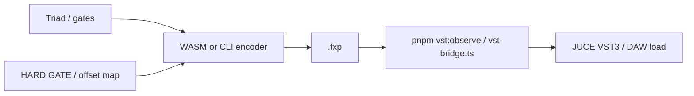

# FIRE — runtime (assessment §A–C, §L)

Triad handoff, WASM export path, web shell — satellite of **`docs/FIRE.md`**.

## A. Dock & Mercury (invariants)

**`PromptAudioDock`:** **`hasPresets`** → results subtree; else **`EarModeController`**. Orb remount on switch. **`onListeningChange(false)`** when presets appear. Detail: **`apps/web-app/docs/MERCURY-BALL.md`**.

---

## B. Triad optimization (canonical)

**Weights:** DeepSeek **0.40**, Llama **0.35**, Qwen **0.25**. **8** candidates; **8s** / panelist (default client fetch; **QWEN** **18s** — **`TRIAD_PANELIST_CLIENT_TIMEOUT_MS`**). **Hardened V4 Refinery:** Mandatory pre-parse validation and auto-retries on panelist malformed JSON (HESTIA / ATHENA / HERMES) eliminate "amnesia" failures. **Concurrency stress** verified to 32 parallel runs. **`shared-types`** = payload truth. **Source:** `shared-engine` + `app/api/triad/*`.

**Gates (TS):** **`REASONING_LEGIBILITY_MIN_CHARS` = 15**; **`SLAVIC_FILTER_COSINE_THRESHOLD` = 0.80**; **`SLAVIC_TEXT_DICE_THRESHOLD` = 0.75** — **`validate.ts`**, **`score.ts`** (loosened from stub-tight defaults after live **`pnpm test:real-gates`** calibration). **Transmutation Phase 2:** advisory profiles shift weights, Slavic deltas, and prior weights (corpus/taste) within the scoring pipeline.

---

## B2. Web triad handoff

`makeTriadFetcher(false, …)` same-origin; `POST { prompt }` → `{ candidates }`; stubs with `true`; **`middleware.ts`** `x-request-id`; **`env.ts`** for secrets (**`DEEPSEEK_API_KEY`**, **`QWEN_API_KEY`**, optional **`QWEN_BASE_URL`** → **`qwenBaseUrl`**, **`GROQ_API_KEY`** or **`LLAMA_API_KEY`**, optional **`LLAMA_GROQ_MODEL`**).

---

## C. Dock & export

| Rule | Detail |
|------|--------|
| Orb tap | Web preview only |
| Export | Client **`encodeFxp`** (`shared-engine` → `@alchemist/fxp-encoder/wasm`) when **`GET /api/health/wasm`** returns **`{ ok: true, status: "available" }`**. UI disables export when **`status`** is **`unavailable`** (stubbed glue, missing **`fxp_encoder_bg.wasm`**, or **`pkg/`** not found — see **`FIRESTARTER` §10**). |
| Health route | **`app/api/health/wasm/route.ts`** — **`dynamic = "force-dynamic"`**; resolves **`packages/fxp-encoder/pkg`** from **`process.cwd()`** (monorepo root, **`apps/web-app`**, or **`vst/`**). **No** `require.resolve("@alchemist/fxp-encoder/package.json")` (not in **`exports`** — breaks **`next build`**). |
| Frame | `MERCURY_ORB_FRAME_CLASS` |
| Tiers | `useResolvedMercuryTier` — LOD only |

---

## L. Web shell & dev reliability (contract)

**Scope:** Next.js **product shell** — stable **local dev** in a **pnpm monorepo** and **recoverable** client UX when the App Router tree throws. **Not** triad logic; **not** DSP.

| Rule | Detail |
|------|--------|
| **Dev server** | **`apps/web-app/scripts/dev-server.mjs`** — resolves **`next/dist/bin/next`** from **`apps/web-app`** then **repo root**; picks free port **3000–3120**; **`HOST`** default **`0.0.0.0`** (**`127.0.0.1`** for loopback-only); **cyan banner** (**127.0.0.1** + **localhost** hints). Root **`pnpm dev`** / **`npm run dev`** → **`node scripts/with-pnpm.mjs --filter @alchemist/web-app dev`** → **`dev-server.mjs`** (**no** Turbo by default); **`pnpm dev:turbo`** uses **`with-pnpm.mjs exec turbo …`**. |
| **Turbo** | Root **`turbo.json`** — **`envMode: loose`**; **`globalDependencies`** on root lockfiles / workspace config for reliable remote cache invalidation. |
| **Watchpack** | When **`WATCHPACK_POLLING`** is **unset**, dev-server sets **`WATCHPACK_POLLING=true`** (all platforms) to reduce **`EMFILE: too many open files, watch`**. Opt out: **`WATCHPACK_POLLING=0 pnpm dev`**. |
| **Webpack / Next** | **`apps/web-app/next.config.mjs`** — in **`dev`**, **`watchOptions`** **polling** for **server and client** compilers; **`config.cache = false`** in dev (reliable vs corrupt packs). **`transpilePackages`**: **`@alchemist/*`**. **`experimental.optimizePackageImports`**: **`@react-three/fiber`**, **`@react-three/drei`**. |
| **Error UI** | **`app/error.tsx`** — segment error boundary (**Try again** / reload, hints). **`app/global-error.tsx`** — root layout failures (own **`html`/`body`**). Both log to **`console.error`**. |
| **`.next` / Turbo cache** | Corrupt or mixed outputs can yield **`MODULE_NOT_FOUND`** (e.g. missing **`./NNN.js`** under **`.next/server`**) or **`PageNotFoundError` / `ENOENT`** for App Router segments during **“Collecting page data”**. Recovery: **`pnpm run clean`** (deletes **`apps/web-app/.next`**) / **`node scripts/with-pnpm.mjs run clean`**, then **`pnpm install`** if needed, then **`pnpm harshcheck`** or **`pnpm dev`**. **`pnpm web:rebuild`** = root clean + forced **`turbo run build --filter=@alchemist/web-app --force`** (preferred when **`harshcheck`** fails mid–**`next build`**). |
| **Legal footer** | **`components/legal/LegalDisclaimer.tsx`** — trademarks + AI/privacy pointer + **third-party preset / indexing** responsibility (not a substitute for counsel). |
| **WASM health** | **`GET /api/health/wasm`** — JSON **`ok`**, **`status`** (`available` \| `unavailable`), **`message`** (operator hint). Run **`pnpm dev`** / **`harshcheck`** from monorepo root (or **`vst/`** scripts that **`cd ..`**) so **`cwd`** resolves **`packages/fxp-encoder/pkg`**. |
| **VST health** | **`GET /api/health/vst`** — JSON **`ok`**, **`available`**, **`version`** (bundle basename or **`unavailable`**), **`lastObservedMs`** (reserved), **`message`**. Filesystem probe only — same artifact path as **`pnpm build:vst`** / **`assert:vst`**; does **not** load the plugin. |
| **VST / `.fxp` sidecar (optional)** | **CLI:** **`pnpm vst:observe`** — Node/TS bridge over **`packages/fxp-encoder/vst-bridge.ts`** + IOM **`vst_observer`** (HARD GATE). **`pnpm vst:observe:gate`** — validate-only (**`validate-offsets-if-sample`**). **`pnpm vst:daemon`** — Rust watcher in **`fxp-encoder`**. **Build:** **`pnpm build:vst`** / **`pnpm build:vst:full`** — **`scripts/vst-build.mjs`** (CMake + install copy when toolchain present). **Assert:** **`pnpm assert:vst`** — optional warn; **`REQUIRE_VST=1`** fail-closed (mirrors WASM). **`pnpm verify:vst`** — **`assert:vst`** + **`vst:observe:gate`**. **Predeploy:** **`pnpm predeploy:vst`**. **Verify hook:** **`ALCHEMIST_VST_VERIFY=1`** on **`pnpm verify:harsh`** / **`verify:web`** runs strict **`assert:vst`** + gate after green pipeline (opt-in; not in default **`harshcheck`**). Native skeleton: **`apps/vst-wrapper/`**. Full contract: **`docs/vst-wrapper.md`**. Does **not** replace browser WASM export or triad gates. |

| **Ops** | **`pnpm alc:doctor`** (= **`node scripts/doctor.mjs`**); **`RUN.txt`**; **`vst/README.md`**; **`docs/vst-wrapper.md`**; **`scripts/with-pnpm.mjs`**; **`FIRESTARTER` §8–§11**. |

### Web app not running — recovery ladder (canonical)

**Preconditions:** Shell **`cwd`** = monorepo root (**`apps/`** + **`packages/`**). **`pnpm alc:doctor`** — **not** **`pnpm doctor`**. After edits to **`packages/shared-engine`** or **`app/api/triad/*`**, **restart `pnpm dev`** (HMR may not reload **`transpilePackages`** triad behavior).

| Symptom | Fix |
|--------|-----|
| Connection refused / blank | **`pnpm dev`** from root; use **exact** URL from **cyan Ready** banner (**port 3000–3120**, not assumed **:3000**). |
| Stale tab | Hard refresh; prefer **127.0.0.1** URL from banner. **`BASE_URL=http://127.0.0.1:<PORT> pnpm test:real-gates`** — **PORT** from banner. |
| **`PageNotFoundError` / `ENOENT` / bad routes** during **`next build`** | Corrupt **`.next`**: **`pnpm run clean`** then **`pnpm harshcheck`** or **`pnpm web:rebuild`**. |
| Triad feels capped at **8000** ms / mismatch vs server | Ensure **`TRIAD_PANELIST_CLIENT_TIMEOUT_MS`** (**QWEN** longer) in **`constants.ts`**; **restart dev**; client + server on same revision. |
| Groq Llama JSON truncated mid-array | Raise **`max_tokens`** in **`apps/web-app/lib/fetch-llama-candidates.ts`** (e.g. **4096**); restart dev. |
| **`EMFILE` / watcher pain** | **`pnpm dev:recover`** → **`pnpm web:dev:fresh`**; polling notes in table rows above. |

**One-shot ladder (order):** **`pnpm alc:doctor`** → **`pnpm run clean`** → **`pnpm install`** (if needed) → **`pnpm verify:harsh`** → **`pnpm dev`** → open banner URL.

**Forbidden** (audit): Silently swallowing production errors with no user feedback; claiming **`LegalDisclaimer`** replaces **`PRIVACY.md`** / counsel for a consumer launch.

**Orientation:** **`FIRESTARTER` §8**. **Red-team:** **`§F`** row “Web shell & dev”.

---
